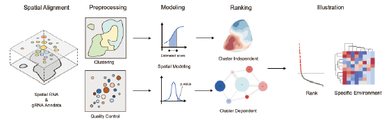

Welcome to SPOT!
=======================================

This is the documentation for SPOT, a Python package for spatial perturbation analysis.

.. image:: https://img.shields.io/pypi/v/spot-seq.svg
   :target: https://pypi.python.org/pypi/spot-seq

.. image:: https://readthedocs.org/projects/spot-seq/badge/?version=latest
   :target: https://spot-seq.readthedocs.io/en/latest/?badge=latest
   :alt: Documentation Status

.. image:: https://img.shields.io/github/license/ZengLab/SPOT
   :target: https://github.com/ZengLab/SPOT/blob/main/LICENSE
   :alt: License

.. image:: https://img.shields.io/github/stars/ZengLab/SPOT?style=social
   :target: https://github.com/ZengLab/SPOT
   :alt: GitHub stars

Read the tutorial here:

https://spot-tutorial.readthedocs.io/en/latest/

Installing using python
------------

SPOT is a tool for systematic and user-friendly identification of gene-of-interest for spatial CRISPR perturbation data. SPOT can be utilized for many sequencing techniques, including Stereo-seq (BGI), Visium (10x genomics) and Nanopore (Oxford Nanopore Tech.). SPOT individually provides gRNA cDNA library manipulation scripts for each platform. After raw data processing and obtaining gRNA read data, SPOT preprocesses the spatial transcriptomics data and gRNA data through many steps of filtering and processing including clustering, filtering and diffusion checks.
The main SPOT algorithm contains 2 cluster aware ranking method and 3 cluster unaware ranking method. Users can run all 5 method and derive consistency analysis with different methods to determine their results and robustness of the analysis. Finally, SPOT provides user-friendly interfaces to illustrate and output the ranking results.

To use SPOT (python version), first install its dependencies using pip or conda.

You can simply install SPOT dependencies using pip through:

.. code-block:: 

   (.venv) $ pip install numpy pandas scipy scikit-learn anndata scanpy

**SPOT** can be ran on both Linux and Mac OS, since it is interpreted by python and R.

Installing using R
------------

To install SPOT (R version), first intall *dev-tools*

.. code-block::

   $ install.packages('devtools')
   $ devtools::install_github("pkuTrasond/SPOT")

R will automatically install all the dependencies.

For more detailed information, please refer to the tutorial.