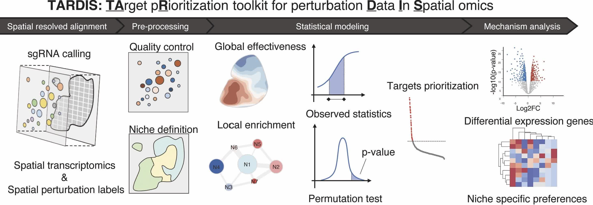

Welcome to TARDIS!
=======================================

This is the github repository for **TARDIS**.

**TARDIS** (TArget pRioritization toolkit for perturbation Data In Spatial omics)
is a versatile and fully open-source toolkit for analyzing spatially resolved CRISPR screen data.

Implemented in both **Python** and **R**.

.. image:: https://img.shields.io/pypi/v/tardis-spac.svg
   :target: https://pypi.python.org/pypi/tardis-spac

.. image:: https://app.readthedocs.org/projects/tardis-tutorial/badge/?version=latest
   :target: https://tardis-tutorial.readthedocs.io/en/latest/?badge=latest
   :alt: Documentation Status

.. image:: https://img.shields.io/github/license/zenglab-pku/TARDIS
   :target: https://github.com/zenglab-pku/TARDIS/blob/master/LICENSE
   :alt: License

.. image:: https://img.shields.io/github/stars/zenglab-pku/TARDIS?style=social
   :target: https://github.com/zenglab-pku/TARDIS
   :alt: GitHub stars

Read the tutorial here:

https://tardis-tutorial.readthedocs.io/en/latest/

Introduction
------------

SPAC-seq enables the direct linkage of genetic perturbation with spatially defined cellular microenvironments by
integrating sgRNA reads with spatial transcriptomic profiles. However, the high-dimensional nature of spatial gene expression data,
combined with multiplexed perturbation libraries sequenced from the same tissue sections, presents unique computational challenges.

To effectively prioritize peturbation targets, we developed **TARDIS**, a versatile and fully open-source toolkit for analyzing spatially resolved CRISPR screen data.

TARDIS is a tool for systematic and user-friendly identification of gene-of-interest.
TARDIS can be utilized for many sequencing techniques, including Stereo-seq (BGI), Visium (10x genomics) and Visium HD (10x genomics).
TARDIS individually provides gRNA cDNA library manipulation scripts for each platform.
After raw data processing and obtaining gRNA read data, TARDIS preprocesses the spatial transcriptomics data and gRNA data through many steps of filtering and processing including clustering.
TARDIS features two analytical models: global and local prioritization.
The global mode treats each sequenced bin as an independent categorical variable, leveraging KL-divergence to quantify perturbation-induced spatial differences across thousands of bins.
In contrast, the local mode first partition bins into micro-niches, reducing the number of categorical variable and transforming original count data into compositional data.
To accurately capture local perturbation enrichment, TARDIS employs Aitchison distance, a robust metric for compositional data analysis, ensuring reliable detection of spatially constrained perturbation effects.
Users can run all 2 models and derive consistency analysis with different models to determine their results and robustness of the analysis.
Finally, TARDIS provides user-friendly interfaces to illustrate and output the ranking results.

Installation Using Python
------------

To use TARDIS (python version), first install its dependencies using pip or conda.

You can simply install TARDIS dependencies using pip through:

.. code-block:: 

   (.venv) $ conda create -n tardis_env python>=3.8
   (.venv) $ conda activate tardis_env
   (.venv) $ conda install numpy pandas scipy scikit-learn anndata scanpy
   (.venv) $ pip install tardis_spac

.. note:: 

   Python version >=3.8 is recommended.

Other dependencies will be installed automatically.
For illustration modules, *Seaborn* and *Matplotlib* are required.

Installation Using R
------------

To install TARDIS (R version), first download the package from `GitHub <https://github.com/stereoseq/TARDIS/tardis_r>`_ and install it using the following commands:

Install core dependencies first (recommended), then install the package:

.. code-block:: r

   install.packages(c("devtools", "Matrix", "ggplot2"))
   # Seurat: install from CRAN or https://satijalab.org/seurat/articles/install.html
   install.packages("Seurat")

   devtools::install("/path/to/stereoseq/tardis_r")
   # If dependency download fails, use:
   # devtools::install("/path/to/stereoseq/tardis_r", dependencies = FALSE)

Alternative without devtools:

.. code-block:: r

   install.packages("/path/to/stereoseq/tardis_r", repos = NULL, type = "source")

For more detailed information, please refer to the tutorial.
