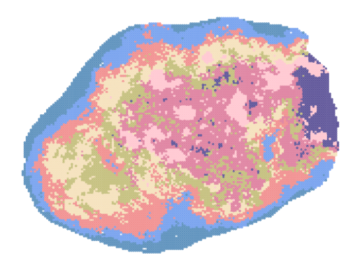

Cellcharter
============================

.. _Cellcharter:

.. py:function:: cluster_cellcharter(adata, batch_key, n_clusters='auto', spatial_key='spatial', cluster_field='cluster', layer=None, random_seed=42, n_nodes_hidden_layers=32, dim_latent_layers=10, n_hidden_layers=5, gene_likelihood_model='poisson', latent_distribution='normal', save_model=None, use_model=None, inplace=True)

   Perform clustering analysis on spatial transcriptomics data using the Cellcharter algorithm.

   :param adata: AnnData object containing gene expression data and spatial coordinates
   :param batch_key: Column name for batch information
   :param n_clusters: Number of clusters, can be an integer or a tuple specifying range, default is 'auto'
   :param spatial_key: Key name for spatial coordinates, default is 'spatial'
   :param cluster_field: Column name to store clustering results, default is 'cluster'
   :param layer: Data layer to use, default is None
   :param random_seed: Random seed, default is 42
   :param n_nodes_hidden_layers: Number of nodes in hidden layers, default is 32
   :param dim_latent_layers: Dimension of latent space, default is 10
   :param n_hidden_layers: Number of hidden layers, default is 5
   :param gene_likelihood_model: Gene likelihood model, default is 'poisson'
   :param latent_distribution: Type of latent distribution, default is 'normal'
   :param save_model: Whether to save model, can be boolean or string path, default is None
   :param use_model: Whether to use existing model, can be boolean or string path, default is None
   :param inplace: Whether to modify the original data, default is True

   :return: If inplace is False, returns the processed AnnData object; otherwise returns None

Example usage:

.. code-block::

   import tardis as td
   adata = td.cluster_cellcharter(adata, batch_key='batch', n_clusters=12, save_model='cellcharter_model.pkl')

    palette = ['turquoise', 'lightcoral', 'steelblue', 'darkslateblue', 'teal', 'cornflowerblue', 'wheat', 'lightpink']
    sns.scatterplot(x=adata.obsm['spatial'][:, 0], y=adata.obsm['spatial'][:, 1], s=8,
                hue=adata.obs.cluster, palette=palette, alpha=0.3, legend=False, edgecolor='none')

