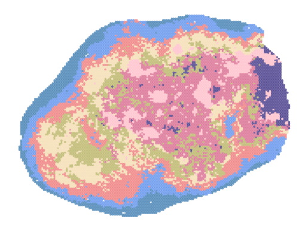

Cellcharter
============================

.. _Cellcharter:

CellCharter-based Spatial Clustering
---------------------------------------

.. py:function:: tardis_spac.external.cluster_cellcharter(adata, batch_key, n_clusters='auto', spatial_key='spatial', cluster_field='cluster', layer=None, random_seed=42, n_nodes_hidden_layers=32, dim_latent_layers=10, n_hidden_layers=5, gene_likelihood_model='poisson', latent_distribution='normal', save_model=None, use_model=None, inplace=True)

   Perform joint spatial and expression-based clustering of spatial transcriptomics data using the CellCharter framework, integrated with scVI for representation learning and deep spatial feature aggregation.

   **Mathematical and Algorithmic Overview:**

   1. **Latent Representation through scVI:**
      - Gene expression profiles are integrated and batch-corrected using [scVI](https://docs.scvi-tools.org/), which employs a variational autoencoder (VAE). For observations (cells, beads, or bins) :math:`x_i`, scVI probabilistically encodes them as low-dimensional latent variables :math:`z_i`:
        \[
            q(z|x) \approx p(z|x)
        \]
        The objective is to maximize the variational lower bound of the marginal log-likelihood, providing a denoised, batch-effect-corrected latent space :math:`Z`.

   2. **Spatial Graph Construction:**
      - Squidpy is used to build a spatial neighbor graph :math:`G = (V, E)`, typically using Delaunay triangulation based on the **spatial_key** coordinates. Each node represents a location/barcode; edges represent spatial adjacency.

   3. **Multi-Layer Neighborhood Aggregation (Feature Stacking):**
      - CellCharter constructs higher-order neighborhoods by iterative aggregation over the spatial graph. For a given spot, the representation vector is iteratively augmented by summarizing (e.g., averaging) the features of its 1-hop, 2-hop, and up to *n_layers* spatial neighbors. This enables the integration of both intrinsic expression and local microenvironment context.

   4. **Clustering and Cluster Number Selection:**
      - The aggregated feature matrix is clustered using methods such as k-means or Gaussian Mixture Models. If **n_clusters** is a range (tuple), CellCharter's AutoK selects the optimal cluster number using criteria like BIC/AIC after running several seeds for stability.
      - The final cluster assignments are stored in `adata.obs[cluster_field]`.

   **Biological Rationale and Application:**
   - CellCharter enables the discovery of spatially and transcriptionally coherent "domains" or "microenvironments," which may correspond to functional tissue niches, malignant subclones, immune cell pockets, or other spatial phenomena.
   - Its strength is the integration of both transcriptional state and spatial organization, providing robust clustering that can reveal structure invisible to expression-only approaches.
   - The approach is compatible with several spatial transcriptomics platforms, including Visium, Stereo-seq, Slide-seq, CosMx, etc. It is robust to batch effects and leverages both local and distant spatial context.

   :param adata: AnnData object, containing both gene expression and spatial coordinates
   :param batch_key: obs column specifying batch or sample identity for batch correction with scVI
   :param n_clusters: Number of clusters (K); can be an int or a tuple (min, max) for automatic selection ('auto' = exhaustive selection in a user-range)
   :param spatial_key: Key in adata.obsm that stores spatial coordinates (default "spatial")
   :param cluster_field: Name of the field in obs where cluster labels are saved (default "cluster")
   :param layer: AnnData layer to use as input (if None, use .X)
   :param random_seed: Random seed for reproducibility (default 42)
   :param n_nodes_hidden_layers: Number of nodes in scVI hidden layers (default 32)
   :param dim_latent_layers: Number of latent dimensions for scVI (default 10)
   :param n_hidden_layers: Number of hidden layers for scVI (default 5)
   :param gene_likelihood_model: Gene likelihood function (default 'poisson')
   :param latent_distribution: Latent distribution choice (default 'normal')
   :param save_model: Whether or where to save the trained scVI model (bool or str path)
   :param use_model: Use an existing saved scVI model (bool or str path)
   :param inplace: If True, modifies adata in place; if False, returns a copy

   :return: The processed AnnData object if inplace=False, otherwise None.

**Example usage:**

.. code-block::

   import tardis as td
   # Perform CellCharter clustering, with automatic cluster number selection between 8 and 20
   clustered_adata = td.external.cluster_cellcharter(
       adata,
       batch_key='batch',
       n_clusters=(8, 20),
       save_model='cellcharter_scvi_model.pkl'
   )

   # Plot spatial clusters using seaborn
   import seaborn as sns
   n_clusters = clustered_adata.obs['cluster'].nunique()
   palette = sns.color_palette('Set3', n_colors=n_clusters)
   sns.scatterplot(
       x=clustered_adata.obsm['spatial'][:, 0],
       y=clustered_adata.obsm['spatial'][:, 1],
       s=8,
       hue=clustered_adata.obs['cluster'],
       palette=palette,
       alpha=0.4,
       legend=False,
       edgecolor='none'
   )

**References:**
- [CellCharter Documentation](https://cellcharter.readthedocs.io/en/latest/)
- Vento-Tormo, et al. CellCharter: scalable and versatile clustering of spatial transcriptomics data. *Nature Biotechnology*, 2023.