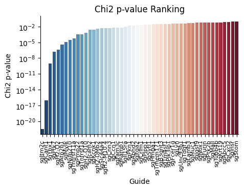
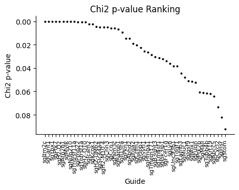
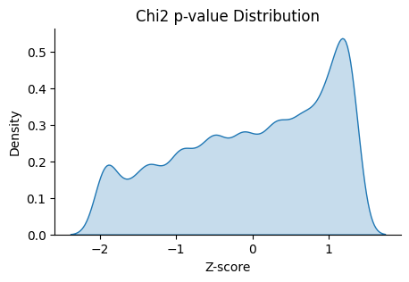

ClusterDependent
===============

.. _ClusterDependent:

CLuster PERMANOVA
-----------------

.. py:function:: rank_by_cluster_permanova(adata, cluster_field, control_guide='sgNon-targeting', n_permutation=999, guide_list=None, result_field='PERMANOVA p-value')

   Ranks guides by PERMANOVA test comparing their cluster distributions to a control guide.

   :param adata: AnnData object containing spatial transcriptomics data
   :param cluster_field: Name of the clustering field in adata.obs to use for grouping
   :param control_guide: Name of the control guide to compare against. Default is 'sgNon-targeting'.
   :param n_permutation: Number of permutations for PERMANOVA test. Default is 999.
   :param guide_list: Optional list of guides to analyze. If None, all guides will be analyzed. Default is None.
   :param result_field: Name of the field to store results in adata.uns. Default is 'PERMANOVA p-value'.
   :return: None. Results are stored in adata.uns[result_field] as a pandas DataFrame.

The function performs PERMANOVA tests comparing each guide's distribution across clusters to the control guide's distribution. A lower p-value indicates a more significant difference from the control guide pattern.

Example usage:

.. code-block::

    import spot as sp
    sp.rank_by_cluster_permanova(adata, cluster_field='leiden')
    sp.plot_ranking(adata, 'PERMANOVA p-value')

.. note::

    PERMANOVA test ranking requires clustering information. Make sure to perform clustering on your data first.
    The test evaluates whether guides show significantly different patterns across clusters compared to the control using permutation-based statistical testing.

All PERMANOVA test results are stored in the :py:attr:`adata.uns` attribute named 'PERMANOVA p-value' by default.

Chi-square Test Ranking
-----------------------

The Chi-square test ranking function helps identify guides with significantly different distributions across clusters compared to a control guide.

.. py:function:: rank_by_chi_square(adata, cluster_field, control_guide='sgNon-targeting', guide_list=None, result_field='Chi2 p-value')

   Ranks guides by their chi-square test p-value compared to a control guide distribution across clusters.

   :param adata: AnnData object containing spatial transcriptomics data
   :param cluster_field: Name of the clustering field in adata.obs to use for grouping
   :param control_guide: Name of the control guide to compare against. Default is 'sgNon-targeting'.
   :param guide_list: Optional list of guides to analyze. If None, all guides will be analyzed. Default is None.
   :param result_field: Name of the field to store results in adata.uns. Default is 'Chi2 p-value'.
   :return: None. Results are stored in adata.uns[result_field] as a pandas DataFrame.

The function performs chi-square tests comparing each guide's distribution across clusters to the control guide's distribution. A lower p-value indicates a more significant difference from the control guide pattern.

Example usage:

.. code-block:: 

    import B_cluster_independent
    B_cluster_independent.rank_by_chi_square(adata, cluster_field='leiden')
    D_plot_ranking.plot_ranking_bar(adata, 'Chi2 p-value')

The result is shown below.

An alternative visualization is shown below.

We can also check the distribution of the guides with low Chi2 p-value.

.. note::

    Chi-square test ranking requires clustering information. Make sure to perform clustering on your data first.
    The test evaluates whether guides show significantly different patterns across clusters compared to the control.

All chi-square test results are stored in the :py:attr:`adata.uns` attribute named 'Chi2 p-value' by default.
