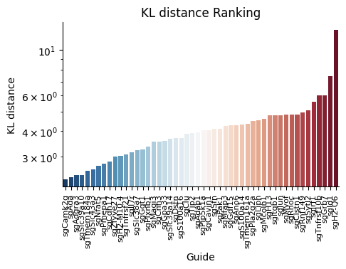
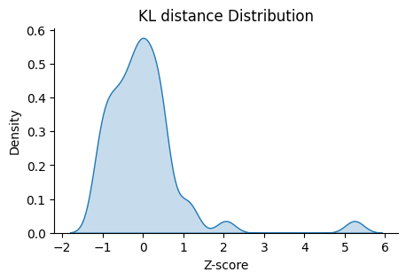

GlobalModule
=================

.. _GlobalModule:

Kernel Density Estimation and Wasserstein Distance
----------------------------------------------------

.. py:function:: rank_by_kernel_estimated_distance(adata, control_guide='sgNon-targeting', guide_list=None, n_permutation=50, n_process=8, return_fig=False, return_dataframe=True, sort_by_replicate='_')

   Ranks guides using kernel density estimation and Wasserstein distance.

   :param adata: AnnData object containing spatial transcriptomics data
   :param control_guide: Name of the control guide, default is 'sgNon-targeting'
   :param guide_list: List of guides to analyze, default is None (analyzes all guides)
   :param n_permutation: Number of permutations for significance testing, default is 50
   :param n_process: Number of parallel processes, default is 8
   :param return_fig: Whether to return the figure object, default is False
   :param return_dataframe: Whether to return the results dataframe, default is True
   :param sort_by_replicate: Delimiter for grouping replicates, default is '_'
   :return: Returns figure or dataframe based on return_fig and return_dataframe settings

The function uses kernel density estimation (KDE) to compute the spatial distribution of each guide and measures its difference from the control guide using Wasserstein distance.

Example usage:

.. code-block::

   import tardis as td
   results = td.cluster_independent.rank_by_kernel_estimated_distance(adata, control_guide='sgNon-targeting')

The results show the Wasserstein distance between each guide and the control group, with larger distances indicating more significant spatial distribution differences. Asterisks (*) indicate statistical significance with p-value < 0.05.

KL Distance Ranking
-------------------

The KL (Kullback-Leibler) distance ranking function helps identify guides with significantly different spatial distributions compared to a reference distribution.

.. py:function:: rank_by_relative_entropy(adata, reference_guide='sum', control_guide='sgNon-targeting', result_field='KL distance', guide_list=None, n_top=50)

   Ranks guides by their KL divergence from a reference distribution.

   :param adata: AnnData object containing spatial transcriptomics data
   :param reference_guide: Reference distribution to compare against. Can be either 'sum' (sum of all guides) or 'ntc' (non-targeting control guide). Default is 'sum'.
   :param control_guide: Name of the non-targeting control guide in the dataset. Default is 'sgNon-targeting'.
   :param result_field: Name of the field to store results in adata.uns. Default is 'KL distance'.
   :param guide_list: Optional list of guides to analyze. If None, all guides will be analyzed. Default is None.
   :param n_top: Number of top guides to return in the results. Default is 50.
   :return: None. Results are stored in adata.uns[result_field] as a pandas DataFrame.

The function computes the KL divergence between each guide's spatial distribution and the reference distribution. A higher KL distance indicates a more distinct spatial pattern compared to the reference.

Example usage:

.. note:: 

    KL Distance Ranking is generally a method to model distribution of guides that have low spatial resolution or the spatial encoding is not the essential feature.
    As KL Distance Ranking dicards the spatial relationship between locations.

.. code-block:: 

    import B_cluster_independent
    B_cluster_independent.rank_by_relative_entropy(adata, reference_guide='sum')
    D_plot_ranking.plot_ranking(adata, 'KL distance')

The result is shown below.

We can check the distribution of the guides with high KL distance.

All KL distance results are stored in the :py:attr:`adata.uns` attribute named 'KL distance' by default.
