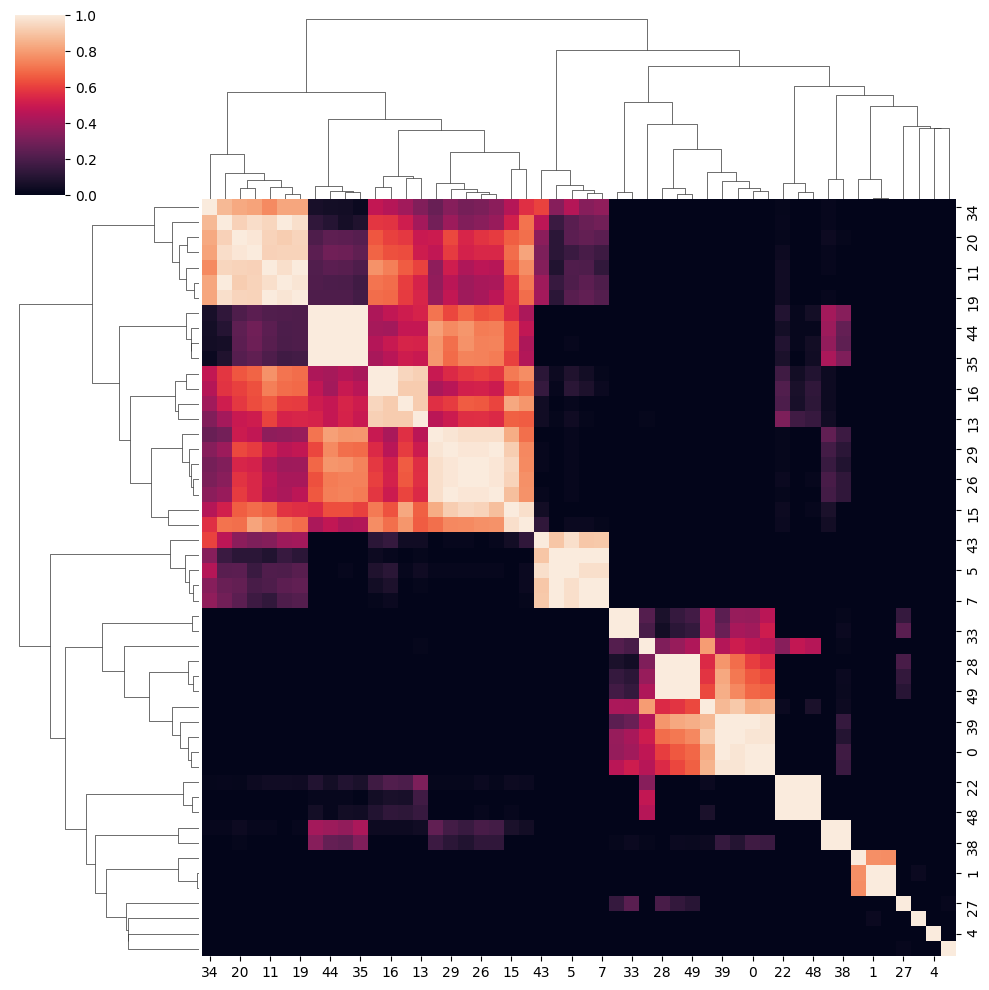
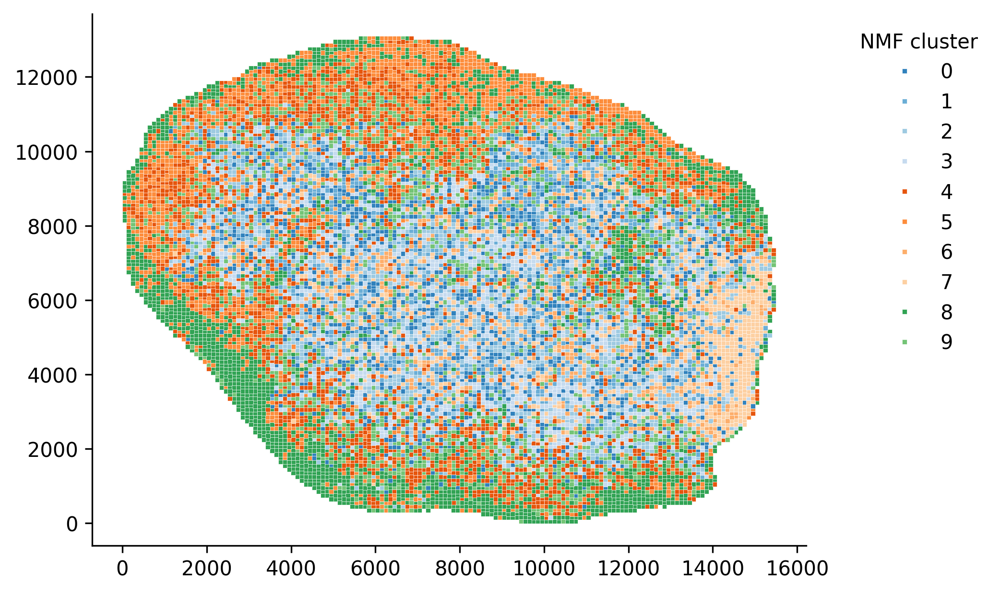

NMF
====================

.. _NMF:

NMF Clustering
----------------

.. attention::

   NMF is a simple clustering method that can be used for quick analysis.
   It is not recommended for complex spatial analysis.

NMF is a simple mathematical trick that can decompose the spatial expression profile into key components
that we are interested in.

We apply NMF to spatial transcriptomics data. Because we want only major signals, we first filter out
genes that are not significantly varied across resolution.

.. code-block::

    fdata.copy()
    fdata.var["mt-"] = fdata.var_names.str.startswith("mt-")
    fdata.var["gm"] = fdata.var_names.str.startswith("Gm")
    fdata.var["rik"] = [True if "Rik" in str else False for str in fdata.var_names]
    fdata = fdata[:, ~fdata.var["mt-"]]
    fdata = fdata[:, ~fdata.var["gm"]]
    fdata = fdata[:, ~fdata.var["rik"]]

    with open('mouseHK.txt', 'r') as f:
        for line in f:
            hk_genes = line.split('\t')
            break
    fdata = fdata[:, [gene for gene in fdata.var_names if gene not in hk_genes]]

The **mouseHK.txt** is a list of housekeeping genes that are derived from singlce-cell sequencing data [1]_.

Then we perform NMF on the filtered data with a simple function. :py:func:`A_preprocessing.nmf_cluster()`

.. code-block::

    nmf_data = A_preprocessing.nmf_clustering(fdata, n_components=50)

.. note::

    The number of components is set to 50, which is a optimal resolution of programs of genes that can be futher clustered. A larger
    number of components can be used for more complex analysis, but a small number is not recommended.

.. code-block::

    clustered_nmf_data = A_preprocessing.nmf_consensus(nmf_data)

In this NMF approach, we decompose the gene expression profile space-wise into an extend of components. Then perform consensus clustering of
component's pearsonr correlation.

.. math::
    :align: center

    \mathbf{A} \approx \mathbf{W} \mathbf{H} \\
    \text{where } \mathbf{A} \in \mathbb{R}^{n \times m} \text{ is the gene expression matrix} \\
    \mathbf{W} \in \mathbb{R}^{n \times k} \text{ is the component matrix} \\
    \mathbf{H} \in \mathbb{R}^{k \times m} \text{ is the coefficient matrix} \\

Then we compute the pearson correlation matrix:

.. math::
    :align: center

    \mathbf{P} = \text{pearson}(\mathbf{H}_i, \mathbf{H}_j) \\

Finally we perform consensus clustering on :math:`\mathbf{P}`.

The clustered program can then be scored using the *scanpy* :py:function:`tl.score_genes()` function.
The score of top optimal genes is store in the :py:attr:`adata.obs` attribute.

.. code-block::

    clustered_nmf_data.obs['nmf_cluster'] = clustered_nmf_data.obs.idxmax(axis=1).str.split('_').str[2].astype(int)

A sptial demonstration of NMF clustering is shown below.

.. [1] He, P., Williams, B.A., Trout, D. et al. The changing mouse embryo transcriptome at whole tissue and single-cell resolution. Nature 583, 760–767 (2020).

