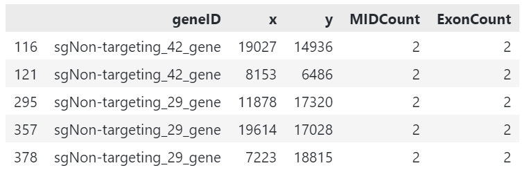
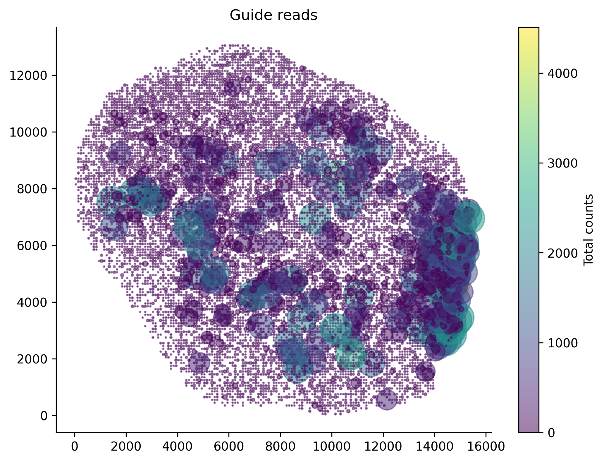
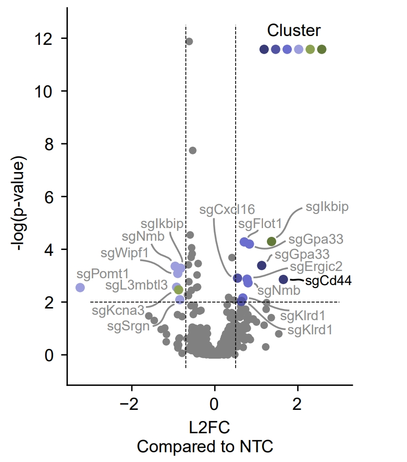

Tutorial
========

.. _Tutorial:

This is an step-by-step tutorial for **TARDIS** analysis. If you are new to **TARDIS**, we recommend you to follow this tutorial.

Also, if you are new to spatial perturbation analysis, we recommend you to read the following paper:

**Unpublished**

.. hint:: 

    **SPAC-seq**, the spatial transcriptomics based CRISPR screening technique, enables the direct
    linkage of genetic perturbation with spatially defined cellular microenvironments by
    integrating sgRNA reads with spatial transcriptomic profiles.

    **TARDIS** represents the first dedicated software package designed specifically for spatial CRISPR screen analysis.

Preparations
------------

Before everything, prepare your spatial CRISPR screen data.

.. important::

    Although **TARDIS** is tested on multiple sequencing based spatial transcriptomics platforms,
    including **BGI Stereo-seq**, **10X Genomics Visium**, and **10X Genomics Visium HD**,
    and may not be limited to these platforms, it is still recommended to ensure that the data meets the following requirements:

    - The data is spatially resolved. (e.g. Spatial barcodes are present)
    - The data **CAN BE** from multiple tissues. (However, it is recommended to be processed separately)
    - The data should contain **guide annotation** (e.g. Perturb-view) or **guide UMI count** matrix. (e.g. SPAC-seq)

TARDIS mainly integrates two forms of data to perform statistical analysis:

- **Guide Mapping Data**: Spatially resolved guide annotation or guide UMI count matrix.
- **Spatial Transcriptomics Data**: Spatial transcriptomics data.

.. warning::

    The guide mapping data and spatial transcriptomics data can be obtained from the same spatial transcriptomics platform,
    or from different spatial transcriptomics platforms.

    However, be aware that different platform origin may require additional alignment that TARDIS does not provide.

In this tutorial, we will use the data from **Unpublished**.
The open-source data is available at [here](https://github.com/zenglab-pku/TARDIS-paper-data).

In this set of data, we have two sets of data:

- BGI Stereo-seq data of a MC38 tumor, infiltrated with perturbed T cell library.
- 10X Genomics Visium HD of subcutaneous mouse MC38 tumor, with metastatic tumor cell perturbation library.

All data contains 2 files:

- `guide.gem`: the GEM file of the guide-targeting data.
- `combined.h5ad`: the combined AnnData object of the tissue Spatial Transcriptomics data and guide-targeting data.

.. note::

    The guide-targeting data is the data that we used to guide the perturbation.
    The tissue Spatial Transcriptomics data is the data that we used to perform the spatial clustering analysis.

    If you are performing **TARDIS** analysis on your own data, you need to combine your tissue Spatial Transcriptomics data and guide-targeting data into one AnnData object also.
    See [here](https://tardis-tutorial.readthedocs.io/en/latest/alignment.html) for more information.

After downloading the data (or obtaining your own data), you can check on the data by loading the AnnData object.

.. note:: 

    Remember to move the data to the directory where you are running the code.
    Jupyter notebook is recommended for this tutorial.

.. code-block::

    import scanpy as sc
    fdata = sc.read_h5ad('combined.h5ad')
    fdata

You will receive the following output:

.. code-block:: 

    AnnData object with n_obs × n_vars = 17224 × 23376
    obsm: 'spatial'

.. note::

    The AnnData object contains the tissue Spatial Transcriptomics data and guide-targeting data.
    The `spatial` is the spatial coordinates of the data, which is used for spatial clustering analysis.
    The `var_names` is the variable names of the data, which is used for guide distribution analysis.
    The `obs_names` is the observation names of the data, which is used to contain the bin information.

More information about the AnnData object can be found at [here](https://scanpy.readthedocs.io/en/stable/api/scanpy.AnnData.html).

Importing necessary libraries
------------

Before starting, we need to import necessary libraries.

.. code-block::

    import scanpy as sc
    import squidpy as sq
    import numpy as np
    import matplotlib.pyplot as plt
    import seaborn as sns
    import pandas as pd

    import sp.preprocessing as spp

**TARDIS** required dependencies import.

.. note::

    Import **TARDIS** using python, you can utilize scanpy, squidpy, numpy, matplotlib, seaborn, and pandas.
    scanpy and squidpy are required for spatial clustering analysis, numpy is required for numerical operations,
    matplotlib and seaborn are required for visualization, and pandas is required for data manipulation.

Read in the data.

.. code-block::

    gem_df = pd.read_csv('guide.gem', sep='\t')
    gem_df.head()

Preprocessing
------------

Spatial perturbation can be highly arbitrary if we cannot perform valid
preprocessing and filtering of low quality guides and bins. Refer to [our paper](https://www.nature.com/articles/s41592-024-02012-z)
for our in house filtering method.

**TARDIS** performs filtering with validation panels with the following methods.

In this tutorial we use our in house spatial transcriptomics data.
This data incorporates a library of **68 guides**, and is sequenced on **BGI Stereo-seq** platform.

.. code-block::

   # perform quality check from BGI stereo-seq GEM output
   sp.preprocessing.filter_qc_bins('guide.gem')

.. image:: ../_images/qc_guide_bins.png
   :align: center

The function processes a GEM file containing guide reads and performs filtering based on the specified parameters:

1. Reads the GEM file and optionally filters for guides with a specific prefix
2. Removes bins with guide counts below the threshold if specified  
3. Handles bins with multiple guides according to the assign_pattern:

   - 'max': Keeps only the guide with highest count in each bin
   - 'drop': Removes all bins that have multiple guides
   - 'all': Keeps all guides in multi-guide bins

4. Optionally binarizes the counts (sets all to 1)
5. Returns filtered DataFrame or saves to file

Example usage:

.. code-block::

   filtered_data = sp.filter_guide_reads('A04091E1.gem', output_path='A04091E1_filtered.gem')

After filtering, we can perform quality control on the filtered data.

.. code-block::

   sp.preprocessing.filter_qc_bins('A04091E1_filtered.gem')

   plt.figure(figsize=(8, 6))
   scatter = plt.scatter(x=gdata.obsm['spatial'][:, 0], y=gdata.obsm['spatial'][:, 1],
                        s=gdata.obs['n_genes_by_counts'], alpha=0.5, c=gdata.obs['total_counts'], cmap='viridis')
   sns.despine()
   plt.colorbar(scatter, label='Total counts')
   plt.title('Guide reads')

   plt.show()

Clustering
----------

Cluster the tissue data means finding similarity of bins in the tissue data implicating the same microenvironment.

In our case, we would like to cluster the tissue into tumor environments that could implicate different guide distribution.
We can simply perform NMF clustering on the tissue data.

.. attention::

   NMF is a simple clustering method that can be used for quick analysis.
   It is not recommended for complex spatial analysis.

NMF is a simple mathematical trick that can decompose the spatial expression profile into key components
that we are interested in.

We apply NMF to spatial transcriptomics data. Because we want only major signals, we first filter out
genes that are not significantly varied across resolution.

.. code-block::

    fdata.copy()
    fdata.var["mt-"] = fdata.var_names.str.startswith("mt-")
    fdata.var["gm"] = fdata.var_names.str.startswith("Gm")
    fdata.var["rik"] = [True if "Rik" in str else False for str in fdata.var_names]
    fdata = fdata[:, ~fdata.var["mt-"]]
    fdata = fdata[:, ~fdata.var["gm"]]
    fdata = fdata[:, ~fdata.var["rik"]]

    with open('mouseHK.txt', 'r') as f:
        for line in f:
            hk_genes = line.split('\t')
            break
    fdata = fdata[:, [gene for gene in fdata.var_names if gene not in hk_genes]]

The **mouseHK.txt** is a list of housekeeping genes that are derived from singlce-cell sequencing data [1]_.

Then we perform NMF on the filtered data with a simple function. :py:func:`spp.nmf_clustering()`

.. code-block::

    nmf_data = spp.nmf_clustering(fdata, n_components=50)

.. note::

    The number of components is set to 50, which is a optimal resolution of programs of genes that can be futher clustered. A larger
    number of components can be used for more complex analysis, but a small number is not recommended.

.. code-block::

    clustered_nmf_data = spp.nmf_consensus(nmf_data)

.. image:: ../_images/nmf_cluster.png
   :align: center

In this NMF approach, we decompose the gene expression profile space-wise into an extend of components. Then perform consensus clustering of
component's pearsonr correlation.

.. math::

    \mathbf{A} \approx \mathbf{W} \mathbf{H} \\
    \text{where } \mathbf{A} \in \mathbb{R}^{n \times m} \text{ is the gene expression matrix} \\
    \mathbf{W} \in \mathbb{R}^{n \times k} \text{ is the component matrix} \\
    \mathbf{H} \in \mathbb{R}^{k \times m} \text{ is the coefficient matrix} \\

Then we compute the pearson correlation matrix:

.. math::

    \mathbf{P} = \text{pearson}(\mathbf{H}_i, \mathbf{H}_j) \\

Finally we perform consensus clustering on :math:`\mathbf{P}`.

The clustered program can then be scored using the *scanpy* :py:function:`tl.score_genes()` function.
The score of top optimal genes is store in the :py:attr:`adata.obs` attribute.

.. code-block::

    clustered_nmf_data.obs['nmf_cluster'] = clustered_nmf_data.obs.idxmax(axis=1).str.split('_').str[2].astype(int)

A sptial demonstration of NMF clustering is shown below.

.. image:: ../_images/NMF_cluster_map.png
   :align: center

Now that we have the clustered data, we can perform guide distribution analysis.

Cluster Dependent Analysis
----------------------------

In cluster dependent analysis, we perform chi-square test to determine the guide specificity in each cluster.
Cluster dependent means that we would like to know the guide specificity in each cluster.

A guide's specificity can be determined by the proportion of the guide's reads in each cluster,
and statistical significance can be determined by chi-square test.

Import the function :py:func:`rank_by_chi_square()` to perform chi-square test.

.. code-block:: 

    import sp.cluster_dependent as spc
    spc.rank_by_chi_square(fdata, cluster_field='nmf_cluster')
    spc.plot_ranking_bar(fdata, 'Chi2 p-value')

The result is shown below.
This function :py:func:`plot_ranking_bar()` is a simple function to plot the chi-square test result using bar plot.

.. image:: ../_images/chi2_bar.png
   :align: center

An alternative visualization is shown below.
This function :py:func:`plot_ranking_scatter()` is a simple function to plot the chi-square test result using scatter plot.

.. image:: ../_images/chi2_scatter.png
   :align: center

We can also check the distribution of the guides with low Chi2 p-value.
This function :py:func:`plot_ranking_hist()` is a simple function to plot the chi-square test result using histogram
to demonstrate the distribution of the guides with low Chi2 p-value.

.. image:: ../_images/chi2_hist.png
   :align: center

.. note::

    Chi-square test ranking requires clustering information. Make sure to perform clustering on your data first.
    The test evaluates whether guides show significantly different patterns across clusters compared to the control.

All chi-square test results are stored in the :py:attr:`adata.uns` attribute named 'Chi2 p-value' by default.

Before we can move on to cluster independent analysis, we can try identifying the guide's specificity in a particular cluster.
**TARDIS** provides a function :py:func:`sp.cluster_independent.volcano_plot()` to perform chi-square test on a particular cluster for each guide,
determining the specificity of each guide in the cluster.

Similar to RNA-seq analysis, we can perform volcano plot to visualize the guide's specificity in a particular cluster.

.. code-block::

    sp.cluster_independent.volcano_plot(fdata, cluster_field='nmf_cluster', cluster_id=0)

In this plot, the x-axis is the guide's specificity in the cluster, and the y-axis is the -log10(p-value) of the chi-square test.
The gray lines is the threshold of the p-value, and the guides with p-value less than the threshold are considered to be specific to the cluster.
Colored dots are the guides with p-value less than the threshold, meaning their specificity is significant in the cluster.

For instance, in the plot above, we can see that the guide 'sgCd44' is specific to the cluster marked with dark blue color, meaning enrichment.

.. note::

    The threshold of the p-value is set to 0.05 by default. You can change the threshold by setting the `threshold` parameter.

Cluster Independent Analysis
----------------------------

In cluster independent analysis, we perform KL divergence test to determine the guide specificity compared to non-targeting guide.
Cluster independent means that we would like to know the guide specificity compared to wild type T cells.

More detailed information about modeling can be found at [our paper](https://www.nature.com/articles/s41592-024-02012-z).

.. note:: 

    KL Distance Ranking is generally a method to model distribution of guides that have low spatial resolution or the spatial encoding is not the essential feature.
    As KL Distance Ranking dicards the spatial relationship between locations.

.. code-block:: 

    import sp.cluster_independent as spc
    spc.rank_by_relative_entropy(fdata, reference_guide='sum')
    spc.plot_ranking(fdata, 'KL distance')

The result is shown below.
This function :py:func:`plot_ranking()` is a simple function to plot the KL divergence test result using bar plot.

.. image:: ../_images/KL_bar.png
   :align: center

We can check the distribution of the guides with high KL distance.
This function :py:func:`plot_ranking_hist()` is a simple function to plot the KL divergence test result using histogram
to demonstrate the distribution of the guides with high KL distance.

.. image:: ../_images/KL_hist.png
   :align: center

All KL distance results are stored in the :py:attr:`adata.uns` attribute named 'KL distance' by default.

.. warning::

    KL divergence test requires reference guide. Make sure to set the reference guide correctly using the `reference_guide` parameter.
    The reference guide can be set to 'sum' or 'ntc' (non-targeting control guide).

.. [1] He, P., Williams, B.A., Trout, D. et al. The changing mouse embryo transcriptome at whole tissue and single-cell resolution. Nature 583, 760–767 (2020).