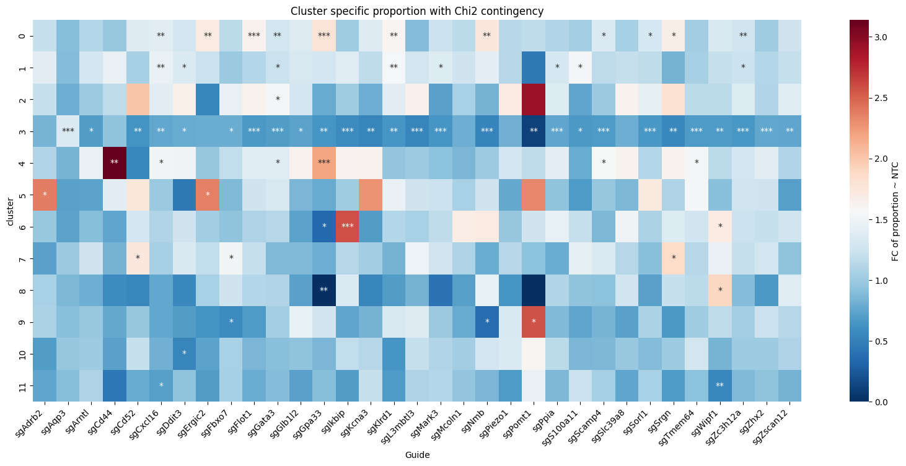

Tutorial
========

.. _Tutorial:

Example script

.. code-block::

    import scanpy as sc
    import squidpy as sq
    import numpy as np
    import matplotlib.pyplot as plt
    import seaborn as sns
    import pandas as pd

    from scipy.stats import chi2_contingency

    from bin import utils

**SPOT** required dependencies import.

Cluster Specific analysis
---------

Based on *Cellcharter* clustering, **SPOT** performes guide distribution analysis
using <u>chi2_contingency</u> method to determine cluster wise guide specificity.

.. code-block::

    MARKER = 'A'
    p_dict = {}

    for cluster in mdf.cluster.unique():
        p_dict[cluster] = []
        for guide in mdf.variable.unique():
            if guide == 'sgnon-targeting': continue
            int_df = mdf[(mdf.marker == MARKER) & (mdf.cluster == cluster) & np.isin(mdf.variable, [guide, 'sgnon-targeting'])][['variable', 'value']].set_index('variable')
            res_df = mdf[(mdf.marker == MARKER) & (mdf.cluster != cluster) & np.isin(mdf.variable, [guide, 'sgnon-targeting'])].set_index('cluster')[['variable', 'value']].groupby('variable').sum()
            chi_df = pd.concat([int_df, res_df], axis=1)
            chi_df.columns = ['cluster_' + str(cluster), 'rest']
            pval = chi2_contingency(chi_df)[1]
            p_dict[cluster].append(pval)
    chi_df = pd.DataFrame(p_dict, index=gdata.var_names[:-1]).T

.. code-block::

    l2fc_dict = {}

    pdf = mdf[mdf.marker == MARKER].set_index(['cluster', 'variable'])['value'].unstack()
    pdf = pdf.div(pdf.sum(axis=0), axis=1)
    pdf = pdf.div(pdf['sgnon-targeting'], axis=0).loc[:, pdf.columns != 'sgnon-targeting']

Visiulization can be performed by **SPOT** in a user friendly manner.

.. code-block::

    annot_df = chi_df.map(lambda x: '***' if x < 0.001 else ('**' if x < 0.01 else ('*' if x < 0.05 else '')))
    plt.figure(figsize=(20, 8))
    heatmap = sns.heatmap(pdf, annot=annot_df, fmt='s', cmap='RdBu_r')

    colorbar = heatmap.collections[0].colorbar
    colorbar.set_label('FC of proportion ~ NTC')
    plt.xticks(rotation=45, ha='right')
    plt.xlabel('Guide')
    plt.title('Cluster specific proportion with Chi2 contingency')
    plt.show()

.. note::

    Notice that preprocessing is highly recommended when using **SPOT**, as low quality bins and guides,
    incorporating controlling guides, can effect results significantly.