Tutorial
========

.. _Tutorial:

This is a step-by-step tutorial for **TARDIS** analysis.

*If you are new to* **TARDIS**, *we recommend you to follow* `this tutorial <https://tardis-tutorial.readthedocs.io/en/latest/>`_.*

Also, if you are new to spatial perturbation analysis, we recommend you to read the following paper:

[Unpublished]

.. admonition:: Reference

    **SPAC-seq**, the spatial transcriptomics based CRISPR screening technique, enables the direct
    linkage of genetic perturbation with spatially defined cellular microenvironments by
    integrating sgRNA reads with spatial transcriptomic profiles.

    **TARDIS** represents the first dedicated software package designed specifically for spatial CRISPR screen analysis.

Preparations
^^^^^^^^^^^^^

Before everything, prepare your spatial CRISPR screen data.

.. note::

    Although **TARDIS** is tested on multiple sequencing based spatial transcriptomics platforms,
    including **BGI Stereo-seq**, **10X Genomics Visium**, and **10X Genomics Visium HD**,
    and may not be limited to these platforms, it is still recommended to ensure that the data meets the following requirements:

    - The data is spatially resolved. (e.g. Spatial barcodes are present)
    - The data **CAN BE** from multiple tissues. (However, it is recommended to be preprocessed separately, and then combined into one AnnData object.)
    - The data should contain **guide annotation** (e.g. Perturb-view) or **guide UMI count** matrix. (e.g. SPAC-seq)

TARDIS mainly integrates two forms of data to perform statistical analysis:

- **Guide Mapping Data**: Spatially resolved guide annotation or guide UMI count matrix.
- **Spatial Transcriptomics Data**: Spatial transcriptomics data.

In this tutorial, we will use the data from [Unpublished].
The open-source data is available at `Official SPAC-seq data repository <https://spac.pku-genomics.org>`_.

In this set of data, we use two sets of data:

- BGI Stereo-seq data of a MC38 tumor, T cell infiltration perturbation library. (Library on SPAC-seq data repo: 'Day7_rep1')
    - Preprocessing and filtering
    - Bottom-up niche independent ranking of guides
- 10X Genomics Visium HD of subcutaneous mouse MC38 tumor, metastatic tumor cell perturbation library. (Library on SPAC-seq data repo: 'Subq')
    - Preprocessing and filtering
    - Clone calling for tumor models
    - Top-down niche dependent enrichment of guides

After downloading the data (or obtaining your own data), you can check on the data by loading the AnnData object.

.. tip:: 

    Remember to move the data to the directory where you are running the code.
    Jupyter notebook is recommended for this tutorial.

.. code-block:: ipython3

    import tardis_spac as td

.. note::

    Import **TARDIS** using python, you can utilize scanpy, squidpy, numpy, matplotlib, seaborn, and pandas.
    scanpy and squidpy are required for spatial clustering analysis, numpy is required for numerical operations,
    matplotlib and seaborn are required for visualization, and pandas is required for data manipulation.

Infiltrated T cell library
--------------------------

In this section, we will perform **TARDIS** analysis on the infiltrated T cell library.
This data is from **BGI Stereo-seq** platform.

Basic information of the data:

- The sample is sliced from a MC38 tumor, with perturbation of T cell injected, disected and sequenced on day 7 of tumor growth.
- The data contains 68 guides, with each perturbation of gene 2 different guide, 2 guides for non-targeting control.

**TARDIS** aims to pinpoint guides that have significant spatial difference of guide to *non-targeting control* guide, which reflects functional effect of the perturbed gene.

Loading and preprocessing
~~~~~~~~~~~~~~~~~~~~~~~~~~

.. code-block::

    import tardis_spac as td
    fdata = td.utils.load_data('Day7_rep1.guide.gem', bin_size=100)

.. parsed-literal::

    AnnData object with n_obs × n_vars = 68003 × 68
    obsm: 'spatial'

.. note::

    The AnnData object contains the tissue Spatial Transcriptomics data and guide-targeting data.
    The `obsm['spatial']` is the spatial coordinates of the data, which is used for spatial clustering analysis.
    The `var_names` is the variable names of the data, which is used for guide distribution analysis.
    The `obs_names` is the observation names of the data, which is used to contain the bin information

More information about the AnnData object can be found at [here](https://scanpy.readthedocs.io/en/stable/api/scanpy.AnnData.html).

In poly-A based SPAC-seq, guide count matrix is stored in 'gem' file.
A gem file is a table file derived from the 'gef' file, which is the output of the **BGI SAW** software. (See `here <https://github.com/STOmics/SAW>`_)
A gem file is a tab-separated file with the following columns:

- `index`: the identical index of the guide detection
- `guide`: the guide name
- `x`: the x coordinate of the guide detection
- `y`: the y coordinate of the guide detection
- `MIDCount`: the guide count
- `ExonCount`: the detected exon count, usually same to `MIDCount`

We can read the gem file using pandas.

.. note::

    `gem` file can be directly read by our module `td.utils.load_bin()`
    however, we will show you how to read the file using pandas for preprocessing.

Filtering and Quality Control
^^^^^^^^^^^^^^^^^^^^^^^^^^^^^^^

Spatial perturbation can be highly arbitrary if we cannot perform valid
preprocessing and filtering of low quality guides and bins. Refer to [Unpublished]
for difference between filtered and unfiltered guide distribution.

**TARDIS** performs filtering with validation panels with the following methods.

.. code-block::

   # perform quality check from BGI stereo-seq GEM output
   td.preprocess.filter_qc_bins('Day7_rep1.guide.gem')

.. image:: ../_images/qc_guide_bins.png
   :align: center

The function processes a GEM file containing guide reads and performs filtering based on the specified parameters:

1. Reads the GEM file and optionally filters for guides with a specific prefix
2. Removes bins with guide counts below the threshold if specified  
3. Handles bins with multiple guides according to the assign_pattern:

   - 'max': Keeps only the guide with highest count in each bin
   - 'drop': Removes all bins that have multiple guides
   - 'all': Keeps all guides in multi-guide bins

4. Optionally binarizes the counts (sets all to 1)
5. Returns filtered DataFrame or saves to file

.. code:: ipython3
    
    import scanpy as sc
    import anndata as ad
    import pandas as pd
    import matplotlib.pyplot as plt
    import seaborn as sns
    
    import numpy as np
    from scipy import sparse
    
    from tqdm import tqdm

.. note::

    Above is a common practice to filter and QC the guide from *GEM* file.
    Here we read in the guide and RNA data from the h5ad file, which can be downloaded from the SPAC-seq data repository.

.. code:: ipython3

    guide_adata = sc.read_h5ad('/home/wpy/stereoseq/tutorial/DATA/Day7_rep1.guide.h5')
    rna_adata = sc.read_h5ad('/home/wpy/stereoseq/tutorial/DATA/Day7_rep1.h5')

.. code:: ipython3

    rna_adata

.. parsed-literal::

    AnnData object with n_obs × n_vars = 567178 × 13177
        obs: 'marker', 'n_genes'
        var: 'mt', 'mt-', 'gm', 'Rb', 'rik', 'n_cells'
        obsm: 'spatial'

.. code:: ipython3

    guide_adata

.. parsed-literal::

    AnnData object with n_obs × n_vars = 568003 × 34
        obs: 'marker'
        obsm: 'spatial'

.. code:: ipython3

    guide_adata.obsm['spatial'] = np.concat([np.zeros((guide_adata.obsm['spatial'].shape[0], 1)), guide_adata.obsm['spatial'][:, 1].reshape(-1, 1), guide_adata.obsm['spatial'][:, 0].reshape(-1, 1)], axis=1)

.. code:: ipython3

    filtered_guide_adata = filter_guide_reads_h5(
        guide_adata,
        guide_prefix='sg',
        binarilize=True,
        assign_pattern='max',
        filter_threshold=1,
    )

.. code:: ipython3

    _, ax = plt.subplots(figsize=(5, 5))
    td.utils.plot_spatial_guides(filtered_guide_adata, scale_factor=1, s=3, ax=ax)
    ax.invert_yaxis()
    plt.show()

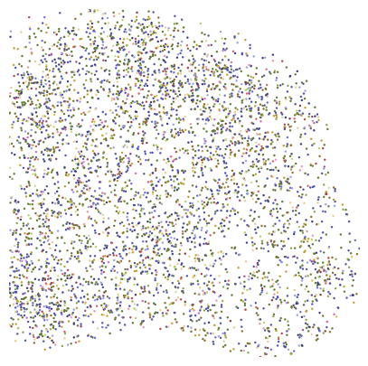

.. code:: ipython3

    filtered_guide_adata.var['n_total_counts'] = filtered_guide_adata.X.toarray().sum(axis=0)

.. code:: ipython3

    sc.pl.highest_expr_genes(filtered_guide_adata, n_top=20, show=True)

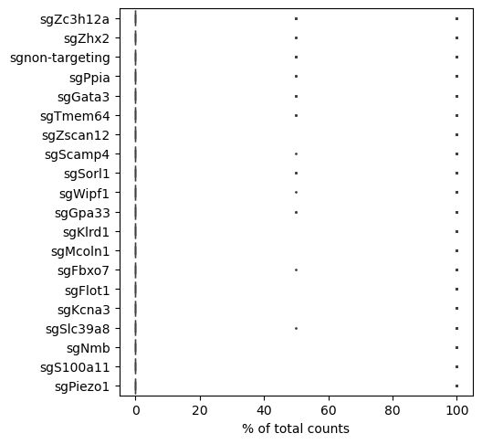

A robust CRISPR screening should have a good distribution of the guides with high expression.

.. note::

    For robust ranking of spatially specific guides, an appropriate guide filter is essential.
    Based on data quality and cell type, we recommend a filter threshold of 200 for poly-A based SPAC-seq on T cells, as an example.

.. code:: ipython3

    td.utils.plot_guide_gene_summary(filtered_guide_adata)

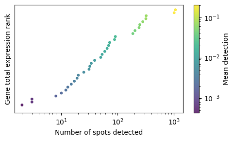

.. code:: ipython3

    filtered_guide_adata = td.utils.combine_guide_replicates(filtered_guide_adata)

We can visualize the spatial distribution of the guides with high expression using :py:func:`td.utils.plot_spatial_guides()`.

Here we visualize the spatial distribution of the guides 'sgZc3h12a' and 'sgnon-targeting'.

.. code:: ipython3

    _, axs = plt.subplots(1, 2, figsize=(11, 5))
    td.utils.plot_spatial_guides(filtered_guide_adata[filtered_guide_adata[:, 'sgZc3h12a'].X > 0], scale_factor=1, s=3, ax=axs[0])
    axs[0].set_title('sgZc3h12a')
    axs[0].invert_yaxis()
    td.utils.plot_spatial_guides(filtered_guide_adata[filtered_guide_adata[:, 'sgnon-targeting'].X > 0], scale_factor=1, s=3, ax=axs[1])
    axs[1].set_title('sgnon-targeting')
    axs[1].invert_yaxis()
    plt.show()

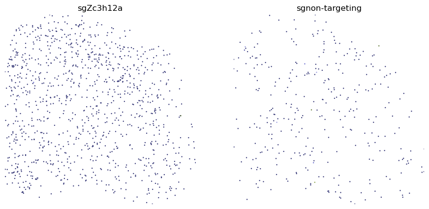

Kullback-Leibler divergence test
^^^^^^^^^^^^^^^^^^^^^^^^^^^^^^^^^^

In cluster independent analysis, we perform KL divergence test to determine the guide specificity compared to non-targeting guide.
Cluster independent means that we would like to know the guide specificity compared to wild type T cells.

.. note:: 

    KL Distance Ranking is generally a method to model distribution of guides that have low spatial resolution or the spatial encoding is not the essential feature.
    As KL Distance Ranking dicards the spatial relationship between locations.

.. code:: ipython3

    td.stats.kl_divergence(
        filtered_guide_adata,
        reference_guide='sgnon-targeting',
        result_field='kl_div',
        n_permutations=10000
    )

.. parsed-literal::

    /home/wpy/miniconda3/envs/tardis/lib/python3.14/site-packages/tqdm/auto.py:21: TqdmWarning: IProgress not found. Please update jupyter and ipywidgets. See https://ipywidgets.readthedocs.io/en/stable/user_install.html
      from .autonotebook import tqdm as notebook_tqdm
    KL divergence permutations: 100%|██████████| 32/32 [01:00<00:00,  1.90s/it]

.. code:: ipython3

    td.utils.plot_top_kde(
        filtered_guide_adata,
        result_field='kl_div',
        sgnt_label='sgnon-targeting',
        top_n=2,
    )

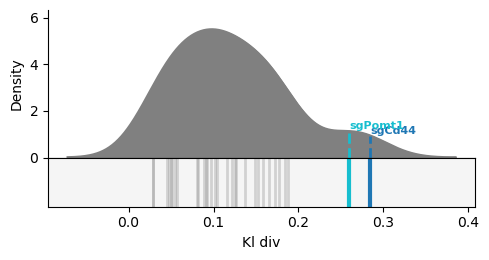

We can check the distribution of the guides with high KL distance.
This function :py:func:`plot_ranking_scatter()` is a simple function to plot the KL divergence test result using scatter plot
to demonstrate the distribution of the guides with high KL distance.

.. code:: ipython3

    td.utils.plot_ranking_scatter(filtered_guide_adata, 'sgnon-targeting', result_field='kl_div')

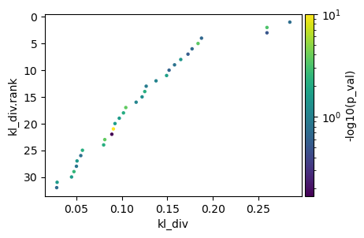

All KL distance results are stored in the :py:attr:`adata.var` attribute named 'kl.div' by default.

.. warning::

    KL divergence test requires reference guide. Make sure to set the reference guide correctly using the `reference_guide` parameter.
    The reference guide can be set to 'sum' or 'ntc' (non-targeting control guide).

Perturbed subcutaneous tumor model
------------------------------------

In this section, we will perform perturbed subcutaneous tumor model analysis.

We will use the perturbed subcutaneous tumor model data.

.. note::

    In this part, we **DID NOT** perform *Cellcharter* analysis for spaitally awared clustering.
    Rather, we used *graphclust* clustering from Spaceranger output.

.. code:: ipython3

    import tardis_spac as td
    
    import scanpy as sc
    import anndata as ad
    import pandas as pd
    import matplotlib.pyplot as plt
    import seaborn as sns
    
    import numpy as np
    from scipy import sparse
    
    from tqdm import tqdm

The following h5 files can be downloaded from above link.

.. code:: ipython3

    guide_adata = sc.read_h5ad('filtered_guide_bc_matrix.h5')
    rna_adata = sc.read_h5ad('filtered_gene_bc_matrix.h5')

.. parsed-literal::

    /path/to/anndata/_core/anndata.py:1884: UserWarning: Variable names are not unique. To make them unique, call `.var_names_make_unique`.
      utils.warn_names_duplicates("var")

Make sure to make the variable names unique.

.. code:: ipython3

    rna_adata.var_names_make_unique()

.. code:: ipython3

    rna_adata

.. parsed-literal::

    AnnData object with n_obs × n_vars = 632032 × 19059
        obs: 'in_tissue', 'array_row', 'array_col'
        var: 'gene_ids', 'feature_types', 'genome'
        obsm: 'spatial'

.. code:: ipython3

    guide_adata

.. parsed-literal::

    AnnData object with n_obs × n_vars = 632032 × 1520
        obs: 'in_tissue', 'array_row', 'array_col'
        var: 'gene_ids', 'feature_types', 'genome'
        obsm: 'spatial'

**TARDIS** provides a function :py:func:`td.utils.plot.plot_spatial_guides()` to plot the spatial guides.

.. note::

    *Image* can be provided together with scale_factor to plot the spatial guides on the HE for reference.

.. code:: ipython3

    _, ax = plt.subplots(figsize=(5, 5))
    td.utils.plot.plot_spatial_guides(guide_adata, scale_factor=scalefactors, s=1, ax=ax)
    plt.show()

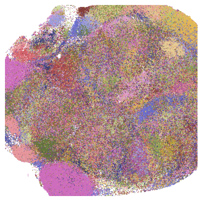

General quanlity control
^^^^^^^^^^^^^^^^^^^^^^^^^^

.. code:: ipython3

    guide_adata.var['n_total_counts'] = guide_adata.X.toarray().sum(axis=0)

.. code:: ipython3

    sc.pl.highest_expr_genes(guide_adata, n_top=20, show=True)

.. parsed-literal::

    /tmp/ipykernel_39694/2812346091.py:1: UserWarning: Some cells have zero counts
      sc.pl.highest_expr_genes(guide_adata, n_top=20, show=True)

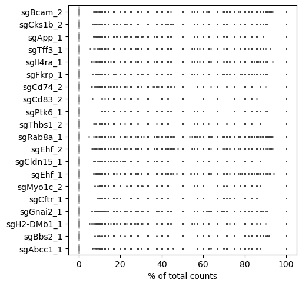

A robust CRISPR screening should have a good distribution of the guides with high expression.

.. code:: ipython3

    td.utils.plot_guide_gene_summary(guide_adata)

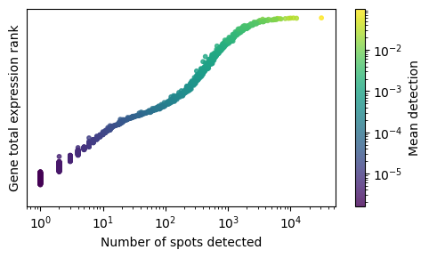

Clone calling for tumor Models
^^^^^^^^^^^^^^^^^^^^^^^^^^^^^^^^^

In tumor models, we would like to call the clones from the spatial guides.

To identify clonal perturbations that locally expanded in the metastatic screen
(defined as spatially proximal tumor bins with the same perturbation),
ensity-based spatial clustering of applications with noise (DBSCAN) and kernel density estimation (KDE) were performed for each perturbation within each tissue section. 

**TARDIS** provides a function :py:func:`td.utils.dbscan_density_region()` to perform dbscan density region clustering.

.. note::
    
    For recovery of larget clones, try raising the *eps* parameter.
    For recovery of small clones, try lowering the *min_samples* parameter.

    Remember to tune *eps* according to the spatial resolution of the platform.
    For example, for 10x Visium data, *eps* should be set to 5-10. (*~8 pixels per 2um bin*)

.. code:: ipython3

    perturb_data, perturb_points_df = td.utils.dbscan_density_region(
        guide_adata,
        "sgBcam_2",
        eps=20,
        min_samples=10,
        label="0",
        mode="most",
        density_level=7,
    )

.. parsed-literal::

    Number of Clusters (excluding noise): 25

We can visualize the clone calling result.

.. code:: ipython3

    _, ax = plt.subplots(figsize=(5, 5))
    sns.scatterplot(
        data=perturb_points_df,
        x="pxl_row_in_fullres",
        y="pxl_col_in_fullres",
        s=2,
        edgecolor="none",
        ax=ax,
    )
    plt.axis('off')
    plt.show()

Here we call top 50 guides with high expression.

.. code:: ipython3

    top_clones = guide_adata.var['n_total_counts'].nlargest(50).index.tolist()
    perturb_points_merge_df = pd.DataFrame()
    perturb_data_list = []
    for clone in tqdm(top_clones):
        perturb_data, perturb_points_df = td.utils.dbscan_density_region(
            guide_adata,
            clone,
            eps=20,
            min_samples=10,
            label="0",
            mode="most",
            density_level=7,
        )
        perturb_data = perturb_data[perturb_data.obs['dbscan_cluster'] != '-1'].copy()
        perturb_data_list.append(perturb_data)
        perturb_points_df['clone'] = clone
        perturb_points_merge_df = pd.concat([perturb_points_merge_df, perturb_points_df])
    perturb_points_merge_df.groupby('clone').size().sort_values(ascending=False)

.. parsed-literal::

    100%|██████████| 50/50 [02:54<00:00,  3.49s/it]

.. parsed-literal::

    clone
    sgBcam_2        26779
    sgApp_1         12063
    sgCks1b_2       11448
    sgTff3_1        10704
    ...
    sgAnk_1          1284
    dtype: int64

Visualize the clone calling result for top 50 guides with high expression.

.. code:: ipython3

    _, ax = plt.subplots(figsize=(5, 5))
    sns.scatterplot(
        data=perturb_points_merge_df,
        x="pxl_row_in_fullres",
        y="pxl_col_in_fullres",
        hue="clone",
        palette="gist_ncar",
        s=0.2,
        edgecolor="none",
        ax=ax,
        legend=False,
    )
    plt.axis('off')
    plt.show()

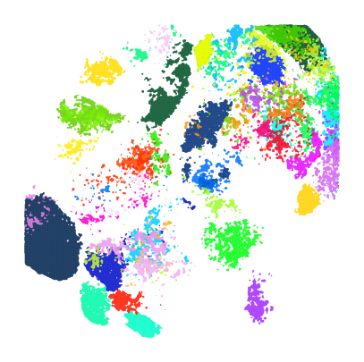

Niche specific analysis
^^^^^^^^^^^^^^^^^^^^^^^^^

A tumor clone can be identified to be specificly distributed in a particular niche.

.. code:: ipython3

    rna_adata.obs['graphclust'] = pd.read_csv('/data200T/SPACseq/HD/output/subq/outs/binned_outputs/square_008um/analysis/clustering/gene_expression_graphclust/clusters.csv', index_col=0)['Cluster'].astype(str)

.. code:: ipython3

    _, ax = plt.subplots(figsize=(5, 5))
    sns.scatterplot(
        data=rna_adata.obs,
        x='array_col',
        y='array_row',
        hue='graphclust',
        palette='tab20b',
        s=0.2,
        edgecolor="none",
        ax=ax,
        legend=False,
    )
    plt.axis('off')
    plt.show()

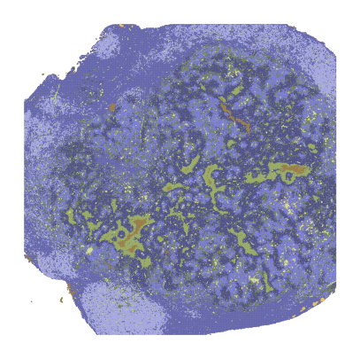

Define the niche by differential gene expression analysis.

.. code:: ipython3

    sc.pp.normalize_total(rna_adata, inplace=True, target_sum=1e4)
    sc.pp.log1p(rna_adata)
    sc.tl.rank_genes_groups(rna_adata, 'graphclust', method='t-test')
    sc.pl.rank_genes_groups(rna_adata, n_genes=25, sharey=False)

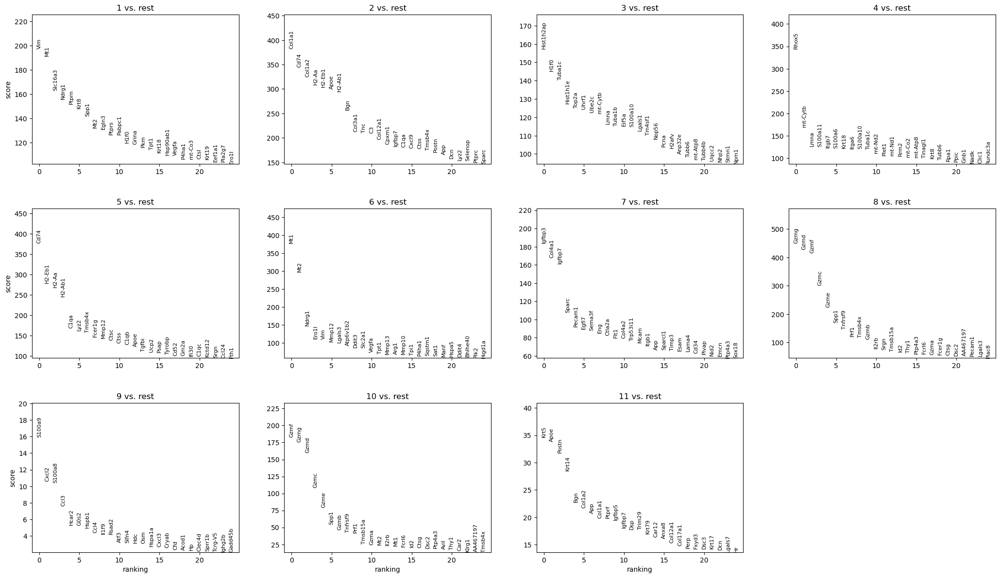

.. code:: ipython3

    guide_adata.obs['graphclust'] = rna_adata.obs['graphclust']

.. code:: ipython3

    perturb_data_merge = sc.concat(perturb_data_list)
    perturb_data_merge = guide_adata[perturb_data_merge.obs_names.unique()].copy()

.. parsed-literal::

    /path/to/anndata/_core/anndata.py:1882: UserWarning: Observation names are not unique. To make them unique, call `.obs_names_make_unique`.
      utils.warn_names_duplicates("obs")

Create a pseudo-guide, that is the sum of all the guides in the clone.

.. warning::

    This is a very simple way to create a pseudo-guide, and may not be very accurate.

    Due to limited detection of 'sgNontargeting' guide, we performed this simple method to create a pseudo-guide.
    It is recommended to use the 'sgNontargeting' guide for reference if detected.

.. code:: ipython3

    if hasattr(perturb_data_merge.X, "toarray"):
        bin_sums = np.ravel(perturb_data_merge.X.sum(axis=1))
    else:
        bin_sums = np.ravel(np.sum(perturb_data_merge.X, axis=1))
    
    pseudo_adata = ad.AnnData(
        X=bin_sums.reshape(-1, 1),
        obs=perturb_data_merge.obs.copy(),
        var=pd.DataFrame(index=['sgPseudo'])
    )

.. code:: ipython3

    pseudo_adata = sc.concat([pseudo_adata, perturb_data_merge], axis=1)

.. code:: ipython3

    pseudo_adata.obs['graphclust'] = rna_adata.obs['graphclust']

Calculate the Aitchison distance between the reference guide and the guides in the clone.

See :py:func:`td.stats.aitchison_distance()` for more details.

.. code:: ipython3

    td.stats.aitchison_distance(
        pseudo_adata,
        'graphclust',
        result_field='aitchison_dist',
        reference_guide='sgPseudo',
        n_permutations=None,
    )

.. code:: ipython3

    td.utils.plot.plot_top_kde(
        pseudo_adata,
        result_field='aitchison_dist',
        sgnt_label='sgPseudo',
        top_n=2,
    )

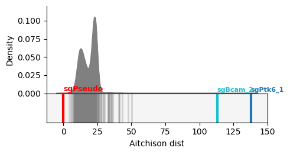

**TARDIS** provides permutation test to calculate the p-value of the Aitchison distance.

.. note::

    The *p_swap* parameter is the probability of swapping the guide labels.
    It is recommended to set to 0.5 for balanced data.
    For unbalanced data, it is recommended to set to 0.1-0.3.

.. code:: ipython3

    filtered_guide_data = pseudo_adata[:, pseudo_adata.var_names.isin(top_clones + ['sgPseudo']).tolist()].copy()
    filtered_guide_data.X = filtered_guide_data.X.astype(np.int64)
    
    td.stats.aitchison_distance(
        filtered_guide_data,
        'graphclust',
        result_field='aitchison_dist',
        reference_guide='sgPseudo',
        p_swap=0.5,
        n_permutations=10000,
    )

.. parsed-literal::

    sgArf6_1: 100%|██████████| 10000/10000 [00:07<00:00, 1251.27it/s]
    sgRab8a_1: 100%|██████████| 10000/10000 [00:08<00:00, 1247.24it/s]
    sgCks1b_2: 100%|██████████| 10000/10000 [00:08<00:00, 1246.28it/s]
    sgAgr3_2: 100%|██████████| 10000/10000 [00:08<00:00, 1246.10it/s]
    ...
    sgTff3_1: 100%|██████████| 10000/10000 [00:08<00:00, 1247.87it/s]

Visualize the Aitchison distance scatter plot.

.. code:: ipython3

    td.utils.plot_aitchison_dist_scatter(filtered_guide_data, 'sgPseudo')

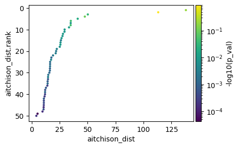

.. [1] He, P., Williams, B.A., Trout, D. et al. The changing mouse embryo transcriptome at whole tissue and single-cell resolution. Nature 583, 760–767 (2020).