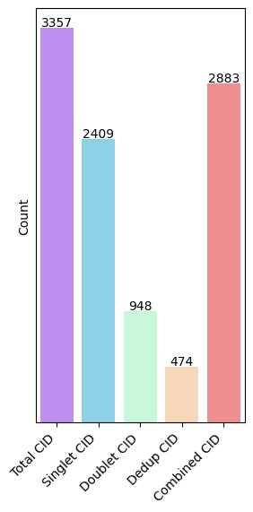

Usage
=====

.. note::

   This here is an API version of all the functions applicable in **SPOT**,
   For more detailed and thorough reference please visit our :ref:`tutorial` site.

Preprocessing
----------------

Spatial perturbation can be highly arbitrary if we cannot perform valid
preprocessing and filtering of low quality guides and bins. Refer to *Paper name*
for our in house filtering method.

**SPOT** performs filtering with validation panels with the following methods.

First import **SPOT** from library.

.. code-block::

   import spot as sp
   sp.set_random_seed(42)

In this tutorial we use our in house spatial transcriptomics data.
This data incorporates a library of **68 guides**, and is sequenced on **BGI Stereo-seq** platform.

.. code-block::

   # perform quality check from BGI stereo-seq GEM output
   sp.preprocessing.filter_qc_bins('A04091E1.gem')

*output:*

Filtering using :py:func:`preprocessing.filter_guide_reads()`

Specify:

* binarilize: Whether to set all bins cnt to 1, recommended with high library size and high resolution.

* assign_pattern: Can be 'max', 'all', 'drop'
   
   'max': Keep only the guide in bin with max count

   'drop': Keep only bins with singlet guide

   'all': Keep all guide in bin

* filter_threshold: Filter bins with guide less than threshold. Unspecify or set to 0 to disable.

.. code-block:: 

   sp.filter_guide_reads('A04091E1.gem', output='A04091E1.gem')

To retrieve a list of random ingredients,
you can use the ``lumache.get_random_ingredients()`` function:

.. autofunction:: lumache.get_random_ingredients

The ``kind`` parameter should be either ``"meat"``, ``"fish"``,
or ``"veggies"``. Otherwise, :py:func:`lumache.get_random_ingredients`
will raise an exception.

.. autoexception:: lumache.InvalidKindError

For example:

>>> import lumache
>>> lumache.get_random_ingredients()
['shells', 'gorgonzola', 'parsley']

Cluster using Cellcharter

.. code-block:: 

   # https://pypi.tuna.tsinghua.edu.cn/simple
   import anndata as ad
   import scvi

   fdata = ad.read_h5ad("A04091E1.h5")

   #sc.pp.highly_variable_genes(fdata, flavor="seurat", n_top_genes=2000, layer="counts", batch_key="time_point", subset=True)

   scvi.settings.seed = 114514
   scvi.model.SCVI.setup_anndata(fdata, batch_key="marker")
   model=scvi.model.SCVI(fdata, n_hidden=128, n_latent=20, n_layers=10, gene_likelihood="poisson", latent_distribution="normal")

   model.train(early_stopping=True, enable_progress_bar=True)

   model.save("scvi.model", save_anndata=True, overwrite=True)

   fdata.obsm["X_scVI"] = model.get_latent_representation(fdata).astype(np.float32)

   sq.gr.spatial_neighbors(fdata, library_key="marker", coord_type="generic", delaunay=True, spatial_key="spatial")
   cc.gr.remove_long_links(fdata)
   cc.gr.aggregate_neighbors(fdata, n_layers=3, use_rep="X_scVI", out_key="X_cellcharter", sample_key="time_point")

*output:*

.. image:: ../_images/cluster_result.png
   :align: center

Clustering
----------------

TODO.

Cluster dependent ranking
----------------

Method :py:func:`tools.cluster_permanova()` performs spatial PERMANOVA.
Permutational multivariate analysis of variance (PERMANOVA) is a non-parametric multivariate statistical permutation test.
We use PERMANOVA to identify distirbution difference of guide to control.

Method :py:func:`tools.cluster_specific_chi2()` performs cluster specific CHI2.
See :ref:tutorial:`tutorial` for detailed information.

Cluster independent ranking
----------------